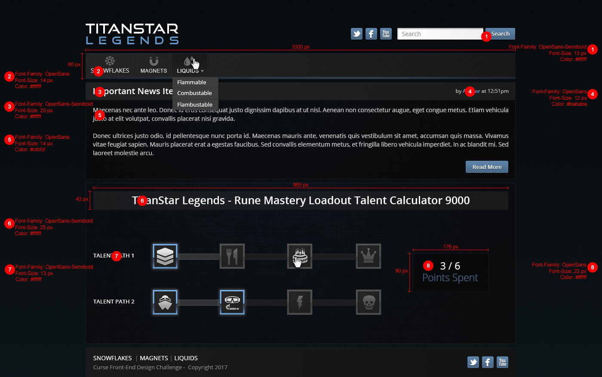

# Front-End Developer Challenge
In this repo you will find a mock-up (in PNG and PSD form), an annotated version of the mock-up, and all the necessary assets (in a separate folder). The design is for a fictitious game called “TitanStar Legends,” and will not be repurposed or otherwise utilized by D&D Beyond – it is only a coding challenge.

Below are specific requirements we have which cannot be adequately expressed through the mock-up.  This is not a timed assignment, but it should probably take 4-5 hours. We ask that you have your assessment completed and returned within 7 days of receiving it. Good luck!

## Getting Started
To get started, fork this repository to your GitHub profile and begin committing to your fork.

## General Requirements
- You may not use any existing SCSS (SASS), LESS, or CSS frameworks.
- You must use SCSS (SASS) to demonstrate competency with the language.

## Heading and Navigation
- At least one navigation item must have sub-navigation.

## News
- Feel free to use whatever Lorem Ipsum text you prefer.

## Rune Mastery Loadout Talent Calculator 9000
- Left click to add points.
- Right click to remove points.
- The user may only use up to 6 points.
- Each item only accounts for one point.
- The point total 
- The user must select the items in order.
    - For example: The user may not put a point in the cake without first having put points in the chevrons and the silverware (in that order).

## Footer
No sub-navigation is necessary on the secondary navigation in the footer.

## Mock-Up (Annotated)

## Submission
To submit your challenge, open a PR to this repo and include `dndbeyond-dev` as a reviewer.
